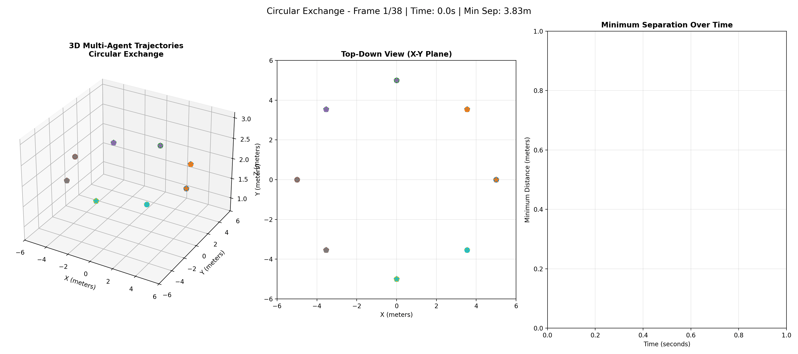

# ORCA-A* 3D

hybrid collision avoidance and path planning library for autonomous agents in 3D environments.




ORCA-A* 3D combines two complementary algorithms for multi-agent navigation Optimal Reciprocal Collision Avoidance and A Star.

This implementation extends the original 2D ORCA algorithm to 3D space.
See paper for details: [ORCA-A* 3D](https://www.sesarju.eu/sites/default/files/documents/sid/2024/papers/SIDs_2024_paper_059%20final.pdf)


## features

- decentralized: no communication required between agents
- 3D Collision avoidance with lateral and vertical maneuvers
- reciprocal behavior: agents share collision avoidance responsibility equally
- path planning: A* with admissible Euclidean heuristic for shortest paths
- adaptive replanning: automatic path updates when obstacles block current routes

## mathematical guarantees

Under ideal conditions (perfect sensing, reciprocal behavior):

- collision-free: No collisions within time horizon τ
- path optimality: A* returns shortest path in visibility graph
- convergence: Agents make progress toward goals
- speed bounded: `||v|| ≤ v_max` always satisfied

## limitations

- assumes holonomic agents (instantaneous velocity changes)
- perfect perception of other agents' positions/velocities
- static obstacles only (no moving obstacles besides agents)

## installation

git clone and cd into the repository

```bash
pip install numpy scipy matplotlib

# Run tests to verify installation
python -m pytest tests/ -v
```

requirements:

- Python 3.8+
- NumPy
- SciPy
- Matplotlib for visualization in examples

## quick start

```python
import numpy as np
from src.hybrid_orca_astar import Agent, simulate

# Define obstacles (3D polyhedra)
obstacles = [
    {
        'vertices': np.array([
            [2, 2, 0], [4, 2, 0], [4, 4, 0], [2, 4, 0],  # Bottom
            [2, 2, 2], [4, 2, 2], [4, 4, 2], [2, 4, 2]   # Top
        ], dtype=float),
        'faces': [
            [0, 1, 2, 3], [4, 7, 6, 5],  # Bottom, Top
            [0, 4, 5, 1], [2, 6, 7, 3],  # Front, Back
            [0, 3, 7, 4], [1, 5, 6, 2]   # Left, Right
        ]
    }
]

# Create agents with collision courses
agent1 = Agent(
    start_pos=[0, 3, 1],
    goal_pos=[6, 3, 1],
    max_speed=1.0,
    R=0.5,           # Collision radius
    tau=5.0,         # Time horizon
    obstacles=obstacles
)

agent2 = Agent(
    start_pos=[6, 3, 1],
    goal_pos=[0, 3, 1],
    max_speed=1.0,
    R=0.5,
    tau=5.0,
    obstacles=obstacles
)

# Run simulation
trajectories = simulate([agent1, agent2], dt=0.1, max_time=20.0)

# trajectories[i] contains position history for agent i
print(f"Agent 1 reached: {trajectories[0][-1]}")
print(f"Agent 2 reached: {trajectories[1][-1]}")
```

## Parameters

### Agent Parameters

| Parameter | Type | Description | Typical Range |
|-----------|------|-------------|---------------|
| `start_pos` | array[3] | Initial position [x, y, z] | - |
| `goal_pos` | array[3] | Target position [x, y, z] | - |
| `max_speed` | float | Maximum velocity magnitude (m/s) | 0.5 - 5.0 |
| `R` | float | Collision avoidance radius (m) | 0.3 - 2.0 |
| `tau` | float | Time horizon for collision prediction (s) | 1.0 - 10.0 |
| `obstacles` | list | List of polyhedral obstacles | - |
| `epsilon` | float | Goal tolerance distance (m) | 0.05 - 0.5 |

### Parameter Guidelines

**conservative**
```python
R=1.0, tau=8.0, max_speed=1.0
```

**more aggressive**
```python
R=0.3, tau=2.0, max_speed=3.0
```

**balanced**
```python
R=0.5, tau=5.0, max_speed=1.5
```

## Obstacle Definition

Obstacles are convex polyhedra defined by vertices and faces:

```python
obstacle = {
    'vertices': np.array([
        [x1, y1, z1],
        [x2, y2, z2],
        # ... more vertices
    ], dtype=float),
    'faces': [
        [0, 1, 2, 3],  # Face as vertex indices
        [4, 5, 6],     # Triangular faces supported
        # ... more faces
    ]
}
```


## Algorithm Details

### ORCA == tactical layer

For each pair of agents, ORCA:

1. **Computes Velocity Obstacle**: A truncated cone in 3D velocity space
   ```
   VO_{i|j}^τ = {v_rel | ∃t ∈ [0, τ]: ||p_rel - t·v_rel|| < R}
   ```

2. **Generates Half-Space Constraint**:
   ```
   H_{i|j} = {v | (v - v_current) · n̂ ≥ (u · n̂)/2}
   ```
   where `u` is the minimal escape vector and `n̂` is the outward normal

3. **Optimizes Velocity**: Finds closest feasible velocity to preferred direction
   ```
   v_new = argmin_{v ∈ ORCA_i ∩ B(0, v_max)} ||v - v_pref||
   ```

### A* Path Planning == strategic layer

1. **Visibility Graph**: Constructs graph from obstacle vertices
2. **Euclidean Heuristic**: Admissible heuristic guarantees optimal paths
3. **Cost Function**: `f(v) = g(v) + h(v)` where `g` is path cost, `h` is heuristic

### Hybrid Integration

- A* computes waypoint sequence avoiding static obstacles
- ORCA adjusts velocity for real-time collision avoidance with other agents
- Replanning triggers when current waypoint becomes obstructed

## Testing

```bash
# Run all tests
python -m pytest tests/ -v

# Run specific test module
python -m pytest tests/test_orca.py -v

# Run with coverage
python -m pytest tests/ --cov=src
```

## Examples

### Multi-Agent Swarm

```python
import numpy as np
from src.hybrid_orca_astar import Agent, simulate

# Circular swap: agents exchange positions
n_agents = 6
radius = 5.0
center = np.array([5.0, 5.0, 1.0])

agents = []
for i in range(n_agents):
    angle = 2 * np.pi * i / n_agents
    offset = radius * np.array([np.cos(angle), np.sin(angle), 0])

    agent = Agent(
        start_pos=(center + offset).tolist(),
        goal_pos=(center - offset).tolist(),
        max_speed=1.0,
        R=0.4,
        tau=5.0,
        obstacles=[]
    )
    agents.append(agent)

trajectories = simulate(agents, dt=0.1, max_time=30.0)
```

### Navigation with Obstacles

```python
# Urban canyon scenario
buildings = [
    {'vertices': np.array([...]), 'faces': [...]},
    {'vertices': np.array([...]), 'faces': [...]}
]

drone = Agent(
    start_pos=[0, 0, 10],
    goal_pos=[100, 100, 10],
    max_speed=5.0,
    R=2.0,
    tau=6.0,
    obstacles=buildings
)

trajectory = simulate([drone], dt=0.1, max_time=60.0)
```
